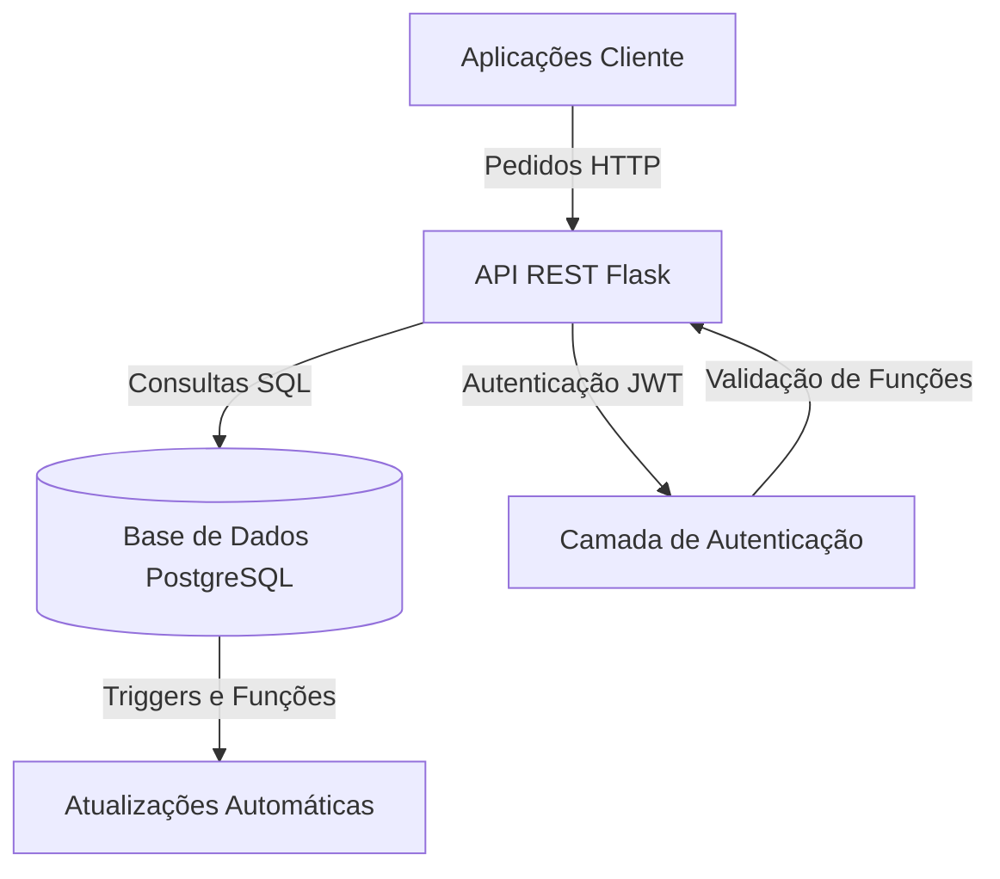

# Relatório Final — Projeto de Bases de Dados 2024/25 (Universidade de Coimbra)

**Autor:** Rui Ribeiro (nº 2021189478)  
**Unidade Curricular:** Bases de Dados (BD)  
**Curso:** Licenciatura em Engenharia Informática (LEI)  
**Ano Letivo:** 2024/2025  
**Instituição:** Departamento de Engenharia Informática, Universidade de Coimbra

## 1. Introdução

Este relatório documenta a implementação de um Sistema de Gestão Académica desenvolvido no âmbito da unidade curricular de Bases de Dados da Universidade de Coimbra. O sistema disponibiliza uma API REST abrangente para gestão de atividades académicas, incluindo inscrição de alunos, gestão de unidades curriculares, submissão de notas e acompanhamento financeiro.

### 1.1 Objetivos do Projeto

Os principais objetivos deste projeto foram:
- Implementar uma API REST segura para gestão académica
- Projetar e implementar um esquema robusto de base de dados PostgreSQL
- Integrar lógica de negócio automatizada através de triggers e procedimentos armazenados
- Garantir consistência de dados e integridade transacional
- Implementar controlo de acesso baseado em funções com autenticação JWT

### 1.2 Tecnologias Utilizadas

O projeto utiliza o seguinte conjunto de tecnologias:
- **Framework Backend:** Flask (Python)
- **Base de Dados:** PostgreSQL
- **Conector de Base de Dados:** psycopg2-binary
- **Autenticação:** PyJWT
- **Controlo de Versões:** Git
- **Testes de API:** Postman (recomendado)

## 2. Arquitetura do Sistema

O sistema segue uma arquitetura cliente-servidor clássica, com uma API RESTful construída utilizando Flask como servidor backend e PostgreSQL como sistema de gestão de base de dados.

### 2.1 Visão Geral dos Componentes



### 2.2 Componentes Principais

1. **API REST (`demoApi.py`)**
   - Processa pedidos e respostas HTTP
   - Implementa lógica dos endpoints
   - Gere conexões com a base de dados
   - Impõe autenticação e autorização

2. **Inicialização da Base de Dados (`initDatabasev2.sql`)**
   - Cria e popula o estado inicial da base de dados
   - Configura dados de exemplo para testes
   - Estabelece configuração base

3. **Triggers da Base de Dados (`triggers.sql`)**
   - Implementa lógica de negócio automatizada
   - Gere contas financeiras
   - Atualiza registos académicos
   - Mantém consistência de dados

4. **Dependências (`requirements.txt`)**
```plaintext
Flask==3.1.0
Werkzeug==3.1.3
psycopg2-binary==2.9.10
PyJWT==2.10.1
```

### 2.3 Fluxo de Autenticação

1. Utilizador fornece credenciais ao `/dbproj/user` (endpoint de login)
2. Sistema valida credenciais e gera token JWT
3. Token contém ID do utilizador e informação de função
4. Pedidos subsequentes incluem token no cabeçalho de Autorização
5. Decorador `@token_required` valida tokens e impõe controlo de acesso baseado em funções

## 3. Design da Base de Dados

### 3.1 Entidades Principais

O esquema da base de dados está organizado em torno de várias entidades-chave:

1. **Gestão de Utilizadores**
   - `users`: Informação base de utilizador e autenticação
   - `student`: Detalhes específicos de estudantes
   - `instructor`: Informação de docentes
   - `admin`: Detalhes de utilizadores administrativos

2. **Estrutura Académica**
   - `degree_program`: Cursos disponíveis
   - `course`: Definições de unidades curriculares
   - `course_edition`: Ofertas de unidades curriculares por ano
   - `class`: Sessões individuais de aulas

3. **Inscrições e Atividades**
   - `degree_enrollment`: Inscrições de estudantes em cursos
   - `course_enrollment`: Participação em unidades curriculares
   - `activity_participation`: Atividades extracurriculares
   - `student_class`: Presença em aulas

4. **Registos Financeiros e Académicos**
   - `financial_account`: Acompanhamento financeiro de estudantes
   - `academic_record`: Acompanhamento de desempenho académico

### 3.2 Lógica de Negócio Automatizada

O sistema implementa vários triggers para automatizar processos críticos de negócio:

1. **Gestão de Conta Financeira**
```sql
CREATE OR REPLACE FUNCTION create_financial_account()
RETURNS TRIGGER AS $$
BEGIN
    IF NOT EXISTS (SELECT 1 FROM financial_account WHERE student_id = NEW.student_id) THEN
        INSERT INTO financial_account (student_id, balance)
        SELECT NEW.student_id, dp.tuition_fee
        FROM degree_program dp
        WHERE dp.degree_id = NEW.degree_id;
    ELSE
        UPDATE financial_account 
        SET balance = balance + (SELECT tuition_fee FROM degree_program WHERE degree_id = NEW.degree_id),
            last_update = CURRENT_TIMESTAMP
        WHERE student_id = NEW.student_id;
    END IF;
    RETURN NEW;
END;
$$ LANGUAGE plpgsql;
```

2. **Academic Record Updates**
```sql
CREATE OR REPLACE FUNCTION update_academic_records()
RETURNS TRIGGER AS $$
DECLARE
    current_avg NUMERIC;
    course_count INTEGER;
BEGIN
    IF NEW.grade IS NOT NULL AND NEW.grade >= 9.5 THEN
        SELECT COALESCE(AVG(grade), 0) INTO current_avg
        FROM course_enrollment 
        WHERE student_id = NEW.student_id AND grade >= 9.5;
        
        UPDATE academic_record 
        SET 
            approved_courses = approved_courses + 1,
            average = current_avg
        WHERE student_id = NEW.student_id;
    END IF;
    RETURN NEW;
END;
$$ LANGUAGE plpgsql;
```

## 4. Implementação da API REST

### 4.1 Endpoints de Autenticação

#### Login (`/dbproj/user` [PUT])
- Autentica utilizadores e emite tokens JWT
- Valida credenciais contra a base de dados
- Retorna token contendo ID do utilizador e função

```python
@app.route('/dbproj/user', methods=['PUT'])
def login_user():
    # Valida credenciais e gera token JWT
    token = jwt.encode({
        'user_id': user[0],
        'role': user[1],
        'exp': datetime.utcnow() + timedelta(hours=24)
    }, app.config['JWT_SECRET_KEY'], algorithm='HS256')
```

### 4.2 Endpoints de Registo

#### Registo de Estudante (`/dbproj/register/student` [POST])
- Restrito a utilizadores administradores
- Cria registos de utilizador e estudante
- Implementa segurança transacional

```python
@app.route('/dbproj/register/student', methods=['POST'])
@token_required
def register_student():
    if flask.g.role != 'admin':
        return flask.jsonify({'status': StatusCodes['unauthorized'], 
                            'errors': 'Apenas admin pode registar estudantes'})
```

#### Registo de Docente (`/dbproj/register/instructor` [POST])
- Endpoint exclusivo para administradores
- Cria perfil de docente
- Gere designação de coordenador

### 4.3 Gestão de Inscrições

#### Inscrição em Curso (`/dbproj/enroll_degree/<degree_id>` [POST])
- Inscreve estudantes em cursos
- Aciona criação de conta financeira
- Valida elegibilidade para inscrição

#### Inscrição em Unidade Curricular (`/dbproj/enroll_course_edition/<course_edition_id>` [POST])
- Gere participação em unidades curriculares
- Verifica pré-requisitos e capacidade
- Gere atribuição de turmas

### 4.4 Operações Académicas

#### Submissão de Notas (`/dbproj/submit_grades/<course_edition_id>` [POST])
- Restrito a coordenadores de unidade curricular
- Atualiza notas dos estudantes
- Aciona atualizações de registo académico

#### Visualização de Detalhes de Estudante (`/dbproj/student_details/<student_id>` [GET])
- Fornece informação abrangente do estudante
- Acessível a administradores e ao próprio estudante
- Agrega dados de unidades curriculares e notas

### 4.5 Endpoints de Relatórios

#### Top 3 Estudantes (`/dbproj/top3` [GET])
```sql
WITH student_avg AS (
    SELECT 
        s.user_id AS student_id,
        s.name AS student_name,
        ROUND(AVG(ce.grade)::numeric, 2) AS average_grade
    FROM course_enrollment ce
    JOIN course_edition ed ON ce.edition_id = ed.edition_id
    JOIN student s ON ce.student_id = s.user_id
    WHERE ce.grade IS NOT NULL
        AND ed.year = 2024
    GROUP BY s.user_id, s.name
)
```

#### Relatório Mensal (`/dbproj/report` [GET])
- Gera estatísticas de desempenho académico
- Acompanha taxas de inscrição e aprovação
- Acesso exclusivo para administradores

## 5. Gestão de Erros e Transações

### 5.1 Gestão de Transações

O sistema implementa uma gestão adequada de transações utilizando blocos try-catch e commit/rollback explícitos:

```python
try:
    # Operações na base de dados
    conn.commit()
    response = {'status': StatusCodes['success']}
except psycopg2.IntegrityError:
    conn.rollback()
    response = {'status': StatusCodes['api_error']}
except (Exception, psycopg2.DatabaseError) as error:
    conn.rollback()
    response = {'status': StatusCodes['internal_error']}
finally:
    conn.close()
```

### 5.2 Códigos de Estado

```python
StatusCodes = {
    'success': 200,
    'api_error': 400,
    'internal_error': 500,
    'unauthorized': 401
}
```

## 6. Implementação de Segurança

### 6.1 Autenticação JWT

O sistema utiliza tokens JWT para autenticação com as seguintes características:
- Expiração de token após 24 horas
- Controlo de acesso baseado em funções
- Validação centralizada via decorador

```python
@wraps(f)
def decorated(*args, **kwargs):
    auth = flask.request.headers.get('Authorization')
    if not auth or not auth.startswith('Bearer '):
        return flask.jsonify({'status': StatusCodes['unauthorized']}), 401
    token = auth.split(' ',1)[1]
    try:
        payload = jwt.decode(token, app.config['JWT_SECRET_KEY'], 
                           algorithms=['HS256'])
        flask.g.user_id = payload.get('user_id')
        flask.g.role = payload.get('role')
    except jwt.ExpiredSignatureError:
        return flask.jsonify({'status': StatusCodes['unauthorized'], 
                            'errors': 'Token expirado'}), 401
```

## 7. Testes e Validação

### 7.1 Dados de Exemplo

O sistema inclui dados de teste abrangentes em `initDatabasev2.sql`:
- Utilizador administrador para gestão do sistema
- Exemplos de estudantes e docentes
- Edições de unidades curriculares e turmas
- Oferta de atividades

### 7.2 Casos de Teste

1. Autenticação de Utilizadores
   - Login com credenciais válidas
   - Tentativa de acesso com token inválido
   - Controlo de acesso baseado em funções

2. Operações Académicas
   - Registo de estudantes
   - Inscrição em unidades curriculares
   - Submissão de notas
   - Geração de relatórios

## 8. Desafios e Soluções

### 8.1 Consistência da Base de Dados

Desafio: Manter a consistência dos dados entre tabelas relacionadas durante operações como eliminação de estudantes.

Solução: Implementação de ordenação cuidadosa de operações DELETE e uso apropriado de transações:

```python
try:
    # Eliminação ordenada respeitando restrições de chave estrangeira
    cur.execute("DELETE FROM activity_participation WHERE student_id = %s")
    cur.execute("DELETE FROM student_class WHERE student_id = %s")
    cur.execute("DELETE FROM course_enrollment WHERE student_id = %s")
    cur.execute("DELETE FROM financial_account WHERE student_id = %s")
    cur.execute("DELETE FROM degree_enrollment WHERE student_id = %s")
    cur.execute("DELETE FROM academic_record WHERE student_id = %s")
    cur.execute("DELETE FROM student WHERE user_id = %s")
    cur.execute("DELETE FROM users WHERE user_id = %s")
    conn.commit()
```

### 8.2 Otimização de Desempenho

Desafio: Consultas complexas para endpoints de relatórios.

Solução: Otimização de consultas SQL usando CTEs e indexação adequada:
- Utilização de cláusulas `WITH` para melhor organização de consultas
- Implementação de agregações eficientes
- Indexação adequada de colunas frequentemente consultadas

## 9. Conclusão

O Sistema de Gestão Académica implementa com sucesso todas as funcionalidades requeridas, mantendo a integridade dos dados e a segurança. O sistema demonstra:

- **Arquitetura Robusta:** Separação clara de responsabilidades entre API e base de dados
- **Segurança:** Autenticação e autorização abrangente baseada em JWT
- **Automatização:** Uso eficiente de triggers para lógica de negócio
- **Integridade de Dados:** Gestão apropriada de transações e tratamento de erros
- **Escalabilidade:** Código e design de base de dados bem estruturados

A implementação segue as melhores práticas tanto no design de bases de dados como no desenvolvimento de APIs, criando um sistema sustentável e extensível adequado às necessidades de gestão académica.